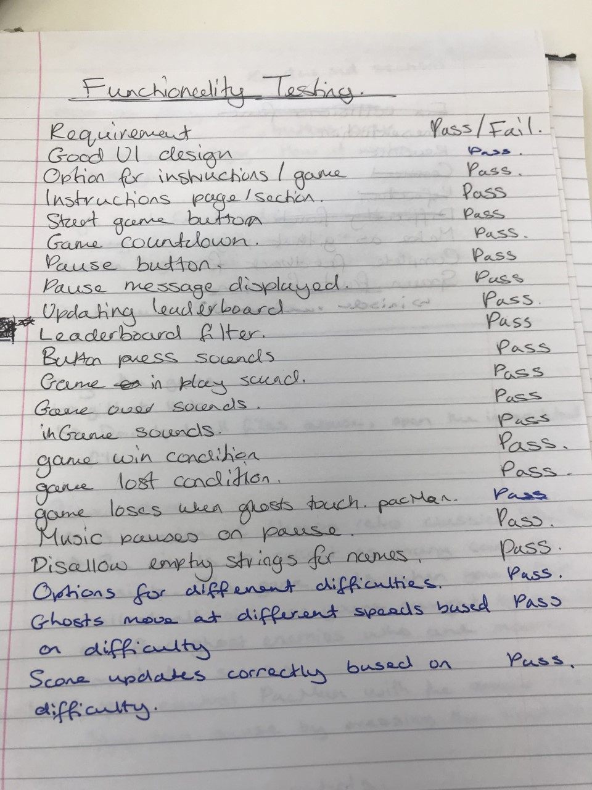

# Browser Based PacMan

## Play The game
Play it online at the following [link]("https://github.com/Murphh/PacMan").

Or clone this GitHub repository and run the **index.html** file.
 
## The game
I decided to build a version of Namco's retro classic *PacMan*. The aim of the game is to collect as many coins as possibe in one go. The game ends when you either collect all coins, or you're caught by one of the four computer generated enemies who are also moving around the game screen.

### Game Controls
You control PacMan using the **arrow keys**, and you can pause the game by pressing the **spacebar**.

- Move up - UP ARROW
- Move down - DOWN ARROW
- Move right - RIGHT ARROW
- Move left - LEFT ARROW
- Pause game - SPACE BAR

### Game Options & Settings

The buttons above the game area relate to the current game. The buttons in the area next to the game relate to displaying instructions or the leaderboard. The flow of the game is:

1.  Select a game difficulty. (Above the game area)
2.  Press the large **Start Game** button.
3. 	 Wait for the game countdown to finish, then play
4.  Click the **Add to Leaderboard** button next to your final score when the game has finished.
5.  **Enter your name** and then press the **Add to Leaderboard** button again.
6. The game should now revert to its initial state so you can play again.

You can also toggle between viewing the **leaderboard** and the **game instructions** by clicking the relevant option in the area next to the game. If you select to view the leaderboard, you may **filter it by name**, based on a given string.

## Features

The current version of my game has the following features.

- Three different difficulty options, **Easy Mode, Hard Mode,** and **Trump Mode**.
- Moveable PacMan character, controlled via arrow keys.
- Computer generated enemies which move freely around the game area.
- Coin objects that PacMan can collect to gain a higher score.
- Dynamically updating score display.
- Game over condition when the enemies touch PacMan.
- Game completed condition if PacMan collects all the coins.
- Ability to restart the game after the previos game ends.
- Ability to pause the game.
- Ability to store your final score in a leaderboard.
- Ability to filter the leaderboard based on a user inputted name.

## Low Level Bugs and Missing Features

My game contains a handful of small bugs and missing features that could greatly improve the overall experience of the game.  This includes:

- Collisions between PacMan and enemies occur too soon and this can cause it to look like the two haven't touched in some situations.
- While it isn't visible, multiple coins actually occupy the same space.
- The coins are placed too close together.
- The background may continue for a few seconds after the game has ended.
- There is no room for error when moving PacMan in a new direction.
- The leaderboard isn't scrollable.

## High Level Improvements

Given more time, I woudl implement the following high level features:

- Add power ups for PacMan
- Make the enemies edible when PacMan has certain power ups.
- Improve the function that controls how the enemies choose the direction in which they move.
- Add multiple levels.
- Add more game modes e.g a timed game mode.
- Give PacMan a varying number of lives based on the game difficulty.
- Allow the user to filter the leaderboard using other criterias than just by name.

## Development Journey

I had a high level timeline for the development of my game. It initially went as followed:

- Saturday/Sunday -  Create the basic user interface with the game background.
- Monday - Make PacMan moveable within the game area.
- Tuesday - Allow PacMan to only move within the confines of the game walls.
- Wednesday -  Populate the screen with coins, and create the enemies.
- Thursday - Implement additional settings, undertake UI & UX testing.
- Friday - README write up and presentation.

I did lots of high level planning for each day, noting design ideas I had, and all the functionality I would need, and making psuedo code for difficult functions or problems.  I would often work through a checklist for each day before moving on to the next days objectives. I was rather rigid with my timelines, but very fluid when it came to the technical problems, often trying multiple approaches before settling on a final implementation.

I placed emphasis on testing, and would test my code repeatedly whenever I made even small changes to the code.  Before finishing my game I also did lots of functionality testing, involving the key game components, and the User interface display.  This allowed me to check all the requirements of my game were met, and that I was accounting for all use cases, and conditions. Below is the rough notes I made during this testing phase.

